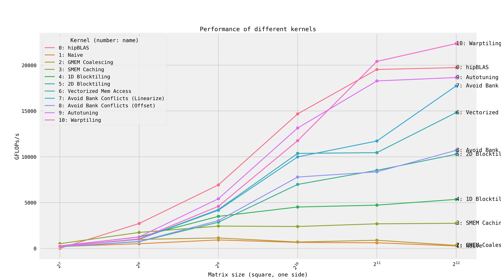
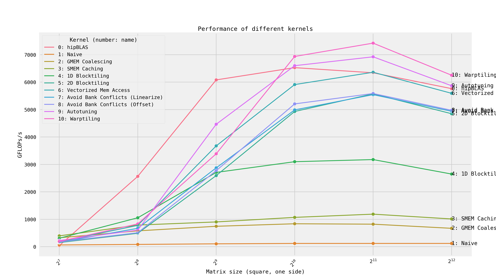

# HIP SGEMM Kernels for NVIDIA/AMD GPUs
A HIP port from the [CUDA version](https://github.com/siboehm/SGEMM_CUDA) and [the original repo](https://github.com/wangzyon/NVIDIA_SGEMM_PRACTICE) with some modifications. 

**HIP kernels codes are actually almost identical to CUDA kernels, so I barely touched the kernel codes.**

## Overview

GFLOPs at matrix size 4096x4096:

#### Test Results on an AMD RX 7900 GRE (gfx1100):

| Kernel                              |   GFLOPs/s | Performance relative to hipBLAS   |
|:------------------------------------|-----------:|:----------------------------------|
| 1: Naive                            |      261.8 | 1.3%                              |
| 2: GMEM Coalescing                  |      320.8 | 1.6%                              |
| 3: SMEM Caching                     |     2733.9 | 13.9%                             |
| 4: 1D Blocktiling                   |     5343   | 27.1%                             |
| 5: 2D Blocktiling                   |    10269.3 | 52.0%                             |
| 8: Avoid Bank Conflicts (Offset)    |    10695.9 | 54.2%                             |
| 6: Vectorized Mem Access            |    14820.4 | 75.1%                             |
| 7: Avoid Bank Conflicts (Linearize) |    17735.4 | 89.9%                             |
| 9: Autotuning                       |    18650.8 | 94.5%                             |
| 0: hipBLAS                          |    19731.5 | 100.0%                            |
| 10: Warptiling                      |    22355   | 113.3%                            |

#### Test Results on an NVIDIA RTX 4060 Laptop:

| Kernel                              |   GFLOPs/s | Performance relative to hipBLAS   |
|:------------------------------------|-----------:|:----------------------------------|
| 1: Naive                            |      119.5 | 2.1%                              |
| 2: GMEM Coalescing                  |      670.3 | 11.6%                             |
| 3: SMEM Caching                     |     1011.9 | 17.6%                             |
| 4: 1D Blocktiling                   |     2649.2 | 46.0%                             |
| 5: 2D Blocktiling                   |     4848.7 | 84.1%                             |
| 7: Avoid Bank Conflicts (Linearize) |     4938.3 | 85.7%                             |
| 8: Avoid Bank Conflicts (Offset)    |     4973.6 | 86.3%                             |
| 6: Vectorized Mem Access            |     5592.8 | 97.0%                             |
| 0: hipBLAS                          |     5763.8 | 100.0%                            |
| 9: Autotuning                       |     5868.7 | 101.8%                            |
| 10: Warptiling                      |     6252.1 | 108.5%                            |

#### Your Results

<!-- benchmark_results -->

<!-- benchmark_results -->

### Slight Modifications
1. **Ported to HIP to work with AMD GPUs and NVIDIA GPUs**
2. Changed the project structure a little bit and added error checks on HIP functions calls (which eliminate the compile time warnings and is a good practice)
3. Changed the way auto tuning works, with the tuning results integrated into the CMake.

### Requirements

#### Hardware Requirements
Any AMD GPU / NVIDIA GPU systems compatible with HIP software stack (and the full ROCm for AMD GPUs and CUDA for NVIDIA GPUs) should work. It was tested on a system with two RX 7900 GRE GPUs / a system with RTX 4060 Laptop.

#### Software Requirements
It was tested on Ubuntu 24.04, ROCm 6.2. Other than ROCm, some basic packages from the Ubuntu repository.(`build-essential`, `cmake`, `bc`) To parse the run result and plot the graph, conda environment is required. For a NVIDIA GPUs, refer to the [note](HIP_NVIDIA.md).

### Build
To build for an AMD GPU, if your target device is `gfx1100`:
```
mkdir build && cd build
cmake -DROCM_TARGET_DEVICE=gfx1100 ..
cmake --build .
```

To build for an NVIDIA GPU, use `-DCUDA_TARGET_ARCH` instead of `-DROCM_TARGET_DEVICE`, and if your target device is `sm70`:
```
cmake -DCUDA_TARGET_ARCH=70 ..
```

### Run the Benchmark
After build, you can run a kernel by running `./sgemm [kernel_num]`. To run the kernel 8, 
```
./sgemm 8
```

To run the benchmark for all kernels and plot the result to a png file,

```
conda env create -f environment.yml
conda activate SGEMM_HIP
./gen_benchmark_results.sh
```

After it finishes running, the numbers in the `README.md` will be changed and `benchmark_results.png` will be generated.

### Auto-tuning for Kernel 9 and Kernel 10

#### Disclaimer
As of now, the cleaning up after each build isn't working as expected. So, you should first build the program like above, and then run the tuning scripts. When one script is run, clean up `./build` directory, rebuild and run the other script.

Running `./scripts/kernel_9_autotuner.sh` and `./scripts/kernel_10_autotuner.sh` will make `./benchmark_results/best_kernel_9_config.cmake` and `./benchmark_results/best_kernel_10_config.cmake` respectively. After running through possible combinations, they will save the best combination to cmake files that will be used during the build process. They will automatically included in the main build if they exist.

If the compilation keeps failing during the auto-tuning, try to clean up the build directory and build the main program again.

## Credits
[CUDA version](https://github.com/siboehm/SGEMM_CUDA) for the source code base

[wangzyon/NVIDIA_SGEMM_PRACTICE](https://github.com/wangzyon/NVIDIA_SGEMM_PRACTICE) for the original article and the implementation
